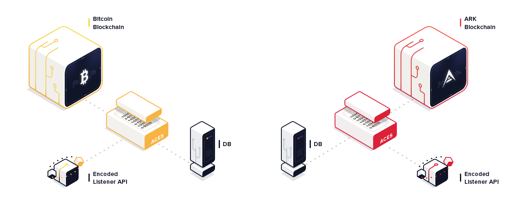

# ACES Listener API Docs

The ACES Listener API Specification defines the API interface for blockchain listeners. 
[SDKs](https://github.com/ark-aces/aces-listener-api#sdks)
are available in Java, Go, PHP, JavaScript, Python, and C#.

The ACES Listener API provides a way for all the different blockchain transaction events to
 be easily consumed via a common REST-ful API. The API allows consumers to create subscriptions 
 and receive blockchain events in real-time using Webhook callbacks.

